# 🚀 Ops Center

### Self-hosted AI-assisted operations platform for Linux, containers, automation, monitoring, security and high availability.

<p align="center">
  <strong>Linux • Docker • Ansible • Monitoring • Security • HA • Automation • AI Agents</strong>
</p>

<p align="center">
  <a href="LICENSE"></a>
  
  
  
  
  
  
</p>

---

## What is Ops Center?

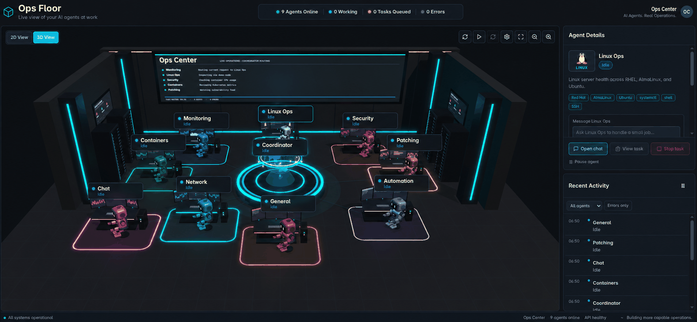

**Ops Center** is an open-source, self-hosted operations platform that brings infrastructure management, automation, observability, security and AI-assisted operations into one interface.

Instead of constantly switching between monitoring dashboards, Ansible, vulnerability scanners, Docker tools, SSH sessions and AI assistants, Ops Center brings them together into a single operations environment.

It is designed primarily for **Linux administrators, DevOps engineers, homelab users and infrastructure teams**.

Ops Center combines:

- 🐧 Linux server management
- 🐳 Docker workload management
- ⚙️ Ansible automation
- 📊 Monitoring and observability
- 🌍 Configurable Traffic Map, persistent history and authentication alerts
- 📱 Optional installable PWA and dedicated wallboards
- 🔐 Vulnerability and security scanning
- 🔄 Patching and scheduled operations
- 🛡️ Optional HA / cluster deployment
- 🤖 AI-assisted infrastructure operations
- 🛰️ Interactive **2D and 3D Operations Floor**
- 💬 Agent chat, task interaction and private collaboration boards
- 📡 Optional integrations such as Nextcloud Talk and external AI providers

> **Project status:** Ops Center is under active development. Validate it in a lab environment before using it against production infrastructure.

---

> **About the screenshots:** The images below show the standard Ops Center interface with synthetic documentation data. They contain no real deployment, accounts, hostnames, traffic or logs. Populated examples are **not installation defaults**: new installations have no managed hosts, and traffic collection and collaboration start disabled. See [screenshot coverage and reproduction](docs/screenshots.md).

## Release highlights — portable monitoring and PWA (2026-09-13)

This source update adds configurable traffic and authentication monitoring,
an optional installable web app, and new assisted operations workflows.

| Area | What is included | Setup and details |
| --- | --- | --- |
| **Traffic Map** | Live observations, persistent history, source filters, timeline, country/domain summaries and a dedicated wallboard. | [Traffic Map](#traffic-map-and-authentication) |
| **Monitoring Settings** | Your own servers, reader types, log paths, source labels, trust rules and history limits; changes apply without rebuilding. | [Configure monitoring](#configure-your-own-monitoring) |
| **Authentication alerts** | Application, SSH and WireGuard signals, configurable trusted origins, reviewable alerts and optional administrator Talk notifications. | [Authentication rules](docs/traffic-map.md#trust-and-notification-rules) |
| **PWA and sessions** | Optional desktop/mobile installation, iPhone/iPad help, explicit offline state, user-controlled updates and renewal of open sessions. | [Progressive Web App](#progressive-web-app) |
| **Agent collaboration** | Owner-private investigations with permitted helpers, diagnostic tools, editable rules, budgets and stop controls. | [Collaboration](#agent-collaboration) |
| **Disk expansion** | One approved workflow for supported LVM/filesystem growth and optional verified Proxmox backing-disk growth. | [Managed disk expansion](#managed-disk-expansion) |
| **Integration updates** | Configured HTTPS Talk delivery, approval/progress messages, authenticated wg-easy v14 access and SSH host-key checks before authentication. | [Integration and access updates](#integration-and-access-updates) |
| **Portable distribution** | Configurable deployment defaults, separate runtime secrets, standard/HA installer support and documented migration requirements. | [Upgrading this release](#upgrading-this-release) |

**Existing installations must apply migrations through `0041` and configure
Traffic Map in Settings.** Old traffic-source and login-trust environment
variables are not imported automatically. Read the upgrade steps before replacing
a running installation.

---

## 🤖 Operations Floor

One of the core ideas behind Ops Center is to make infrastructure automation and AI agents **visible**.

The Operations Floor provides a live 2D/3D representation of specialized agents working across your environment.

| Agent | Responsibility |
| --- | --- |
| 🐧 **Linux Ops** | Linux server health and administration |
| 🐳 **Containers** | Docker and container workloads |
| 📊 **Monitoring** | Metrics, alerts and infrastructure health |
| 🔐 **Security** | Vulnerabilities and security findings |
| 🔄 **Patching** | Patch management and scheduling |
| ⚙️ **Automation** | Infrastructure automation |
| 🌐 **Network** | Network-related operations |
| 💬 **Chat** | User interaction |
| 🧠 **Coordinator** | Routes requests to specialized agents |

Agents can display their current state, tasks and recent activity.

The goal is not simply to create another dashboard. The goal is to build a **self-hosted operations workspace where humans, automation and AI agents can work together**.

---

## ✨ Features

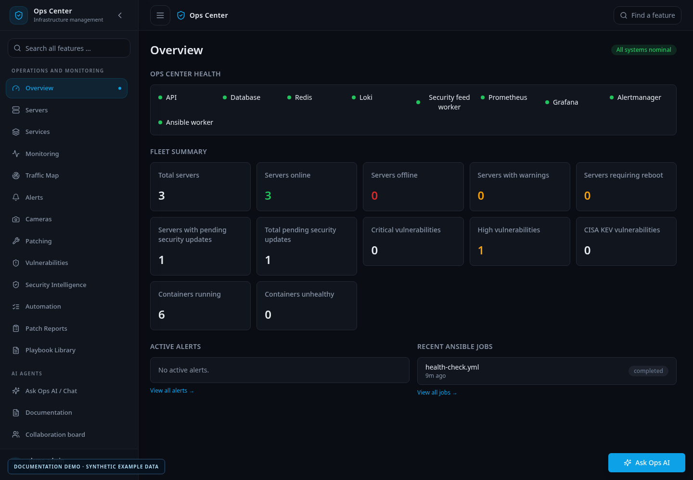

The overview brings example fleet health, resource usage and operational status into one page.

### Infrastructure

- Linux server inventory
- RHEL / AlmaLinux / Rocky Linux focused deployment
- SSH-based management
- Host health information
- Docker workload management
- Infrastructure task execution
- Managed SSH fingerprint verification before sending credentials

<details>
<summary>Screenshots: server inventory and Docker workloads</summary>

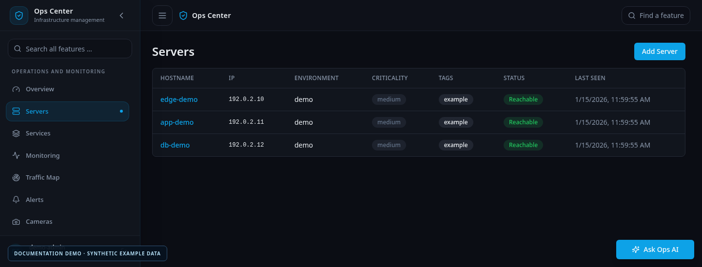

Server inventory with example hosts, reachability and management controls.

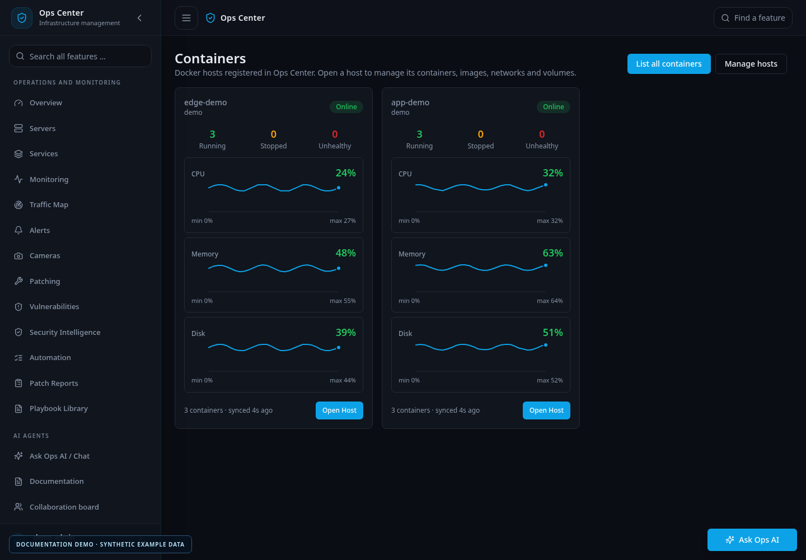

Container status and resource usage grouped by example Docker host.

</details>

### Automation

- Ansible execution worker
- Scheduler
- Infrastructure playbooks
- Remote task execution
- Scheduled operations
- Single-approval disk expansion with preview, capacity checks and resumable requests

<details>
<summary>Screenshots: Ansible automation and patch management</summary>

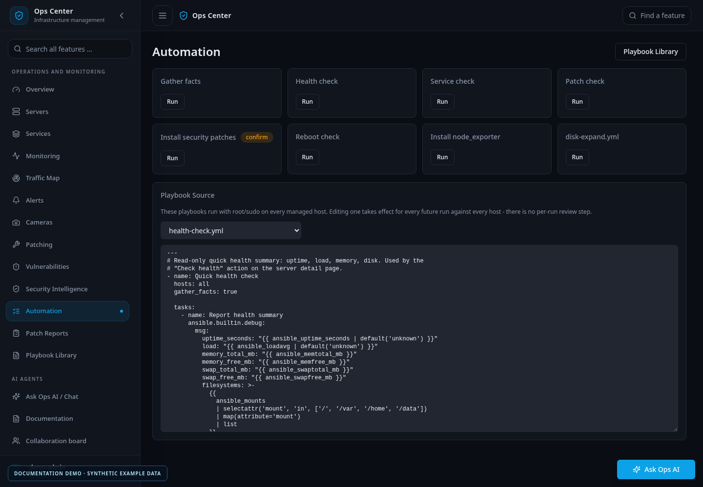

Browse the bundled read-only health-check playbook and automation actions. No playbook was executed for this image.

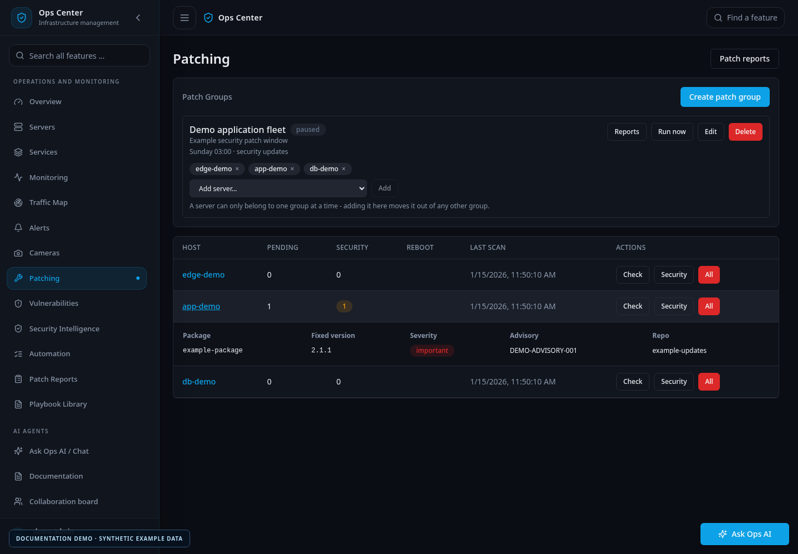

Review a synthetic security update and a patch group with scheduling disabled.

</details>

### Monitoring

- Prometheus
- Grafana
- Alertmanager
- Loki
- Blackbox Exporter
- Optional cAdvisor metrics
- Configurable live Traffic Map and PostgreSQL-backed traffic history
- Authentication observations, security alerts and collection health
- Dedicated Traffic Map wallboard for desktop, tablet and installed PWA

<details>
<summary>Screenshots: monitoring and logs</summary>

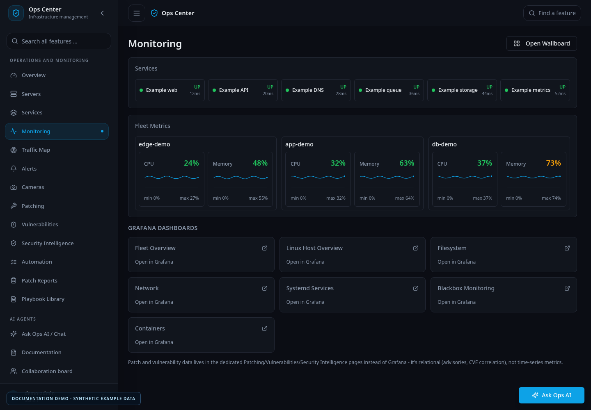

Service availability, probe latency and fleet resource charts from example data.

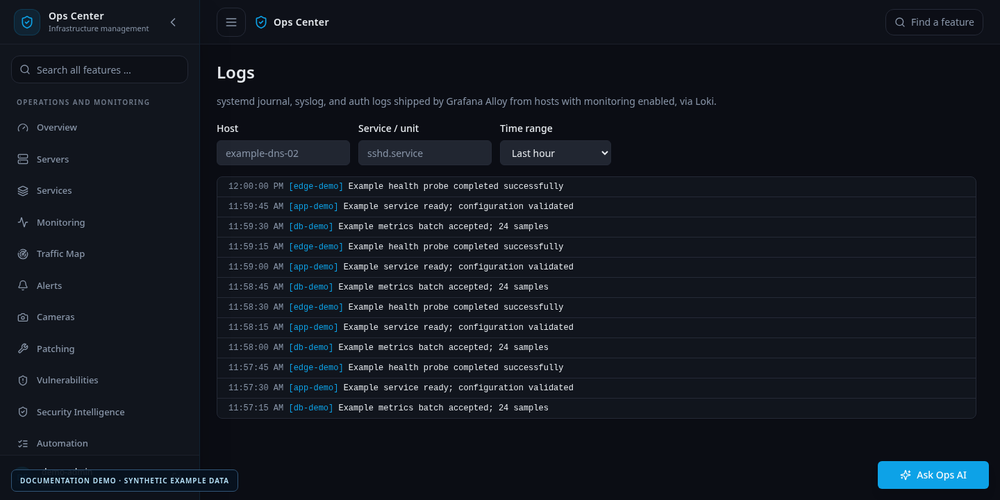

Searchable log view populated only with generated documentation messages.

</details>

### Security

- Trivy vulnerability scanning
- Security worker
- Container security operations
- Infrastructure findings
- Vulnerability visibility

<details>
<summary>Screenshot: vulnerability management</summary>

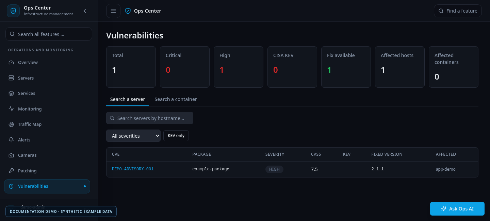

A fictional advisory demonstrates severity, package fixes and affected-host visibility.

</details>

### 🛡️ High Availability / Cluster

Ops Center includes an optional portable HA reference deployment for **two application/database nodes plus an independent witness**.

- Active application stack on both app nodes
- PostgreSQL 17 HA with **Patroni**
- **etcd** three-member quorum across both app nodes and the witness
- PostgreSQL primary/replica streaming replication
- Local **HAProxy `pg-router`** on each application node that follows the Patroni primary
- Redis primary/replica topology
- **Redis Sentinel** on both app nodes plus the witness, quorum 2
- Redis/Celery primary discovery through Sentinel
- RedBeat shared scheduling lock across application nodes
- Cluster status page for PostgreSQL and Redis health
- Administrative PostgreSQL **switchover from the UI**
- Fresh HA topology and credentials generated outside the repository
- Ansible-based preparation using `deploy/ha.yml`

The witness participates in quorum but holds no PostgreSQL data or application signing credentials.

The reference HA bundle deliberately leaves external application ingress to the operator. In the author's deployment, **Nginx Proxy Manager is placed behind a floating application VIP** to provide a stable HTTPS endpoint in front of both active application nodes. This is a deployment example rather than a hard dependency: the public HA bundle does **not** automatically provision Nginx Proxy Manager, the floating application VIP, keepalived or another redundant external load balancer. Operators can provide an equivalent redundant ingress design that fits their environment.

HA monitoring storage is also not shared automatically; Prometheus, Loki and related local data remain node-local in the reference topology.

See **[HA / cluster deployment](docs/ha.md)** for the complete topology, network boundaries, failover tests, backup guidance and upgrade procedure.

<details>
<summary>Screenshot: HA cluster status</summary>

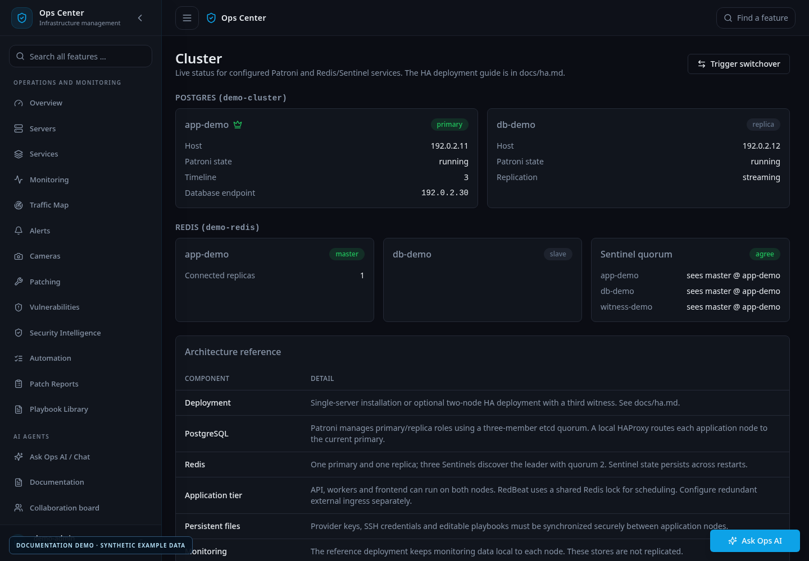

Example PostgreSQL primary/replica roles and Redis Sentinel health. The topology and addresses are documentation data.

</details>

### AI

AI functionality is optional — **Ops Center can operate without an AI provider configured**.

The architecture includes a dedicated AI worker and provider integrations while keeping infrastructure execution separated into specialized workers. Bring your own provider credentials.

Administrators can also enable private collaboration investigations with selected
agents, explicit diagnostic tools and configurable budgets. Each investigation
records questions, evidence and the lead agent's response. See
[Agent collaboration](#agent-collaboration).

<details>
<summary>Screenshot: specialist agents</summary>

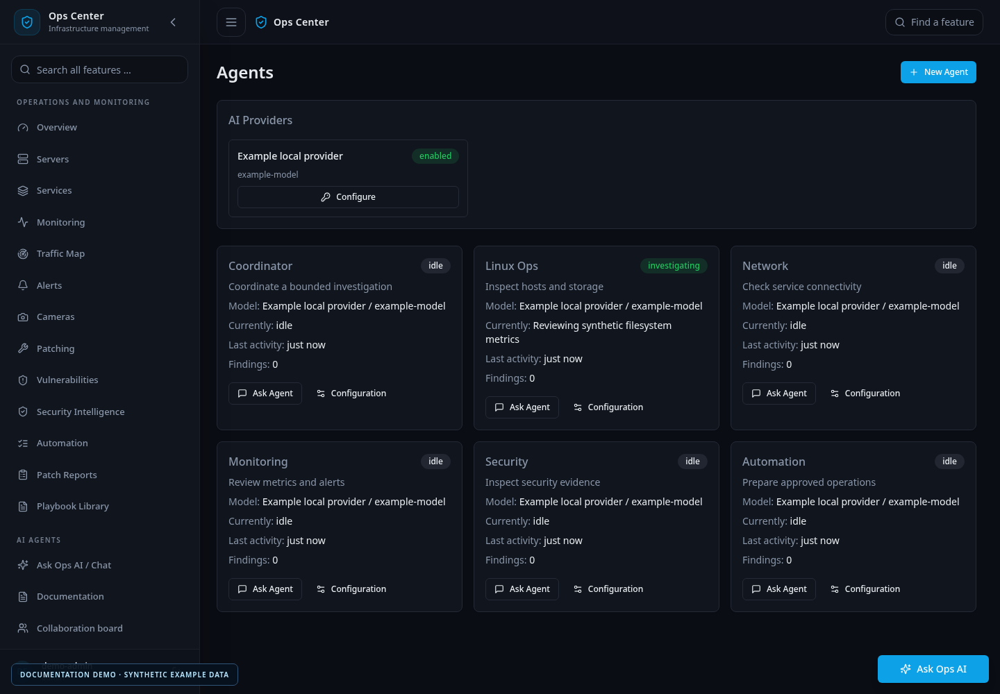

Agent responsibilities, status, model settings and allowed tools, using a fictional provider.

</details>

---

## 🏗️ Architecture

### Standard deployment

```text
                         ┌──────────────────────┐
                         │      Web Browser     │
                         └──────────┬───────────┘
                                    │
                              ┌─────▼─────┐
                              │   Caddy   │
                              │   Proxy   │
                              └─────┬─────┘
                                    │
                 ┌──────────────────┴──────────────────┐
                 │                                     │
          ┌──────▼──────┐                       ┌──────▼──────┐
          │    React    │                       │   FastAPI   │
          │   Frontend  │                       │     API     │
          └─────────────┘                       └──────┬──────┘
                                                     │
              ┌──────────────────────────────────────┼─────────────────────┐
              │                  │                   │                     │
       ┌──────▼──────┐    ┌──────▼──────┐    ┌──────▼──────┐      ┌──────▼──────┐
       │   Ansible   │    │  AI Worker  │    │  Security   │      │  Scheduler  │
       │   Worker    │    │             │    │   Worker    │      │             │
       └─────────────┘    └─────────────┘    └─────────────┘      └─────────────┘
              │
              ▼
        Managed Linux Hosts

         Prometheus ── Grafana ── Loki ── Alertmanager ── Trivy

          PostgreSQL                                  Redis
```

### HA / cluster deployment

```text
                           HTTPS clients
                                │
                   ┌────────────▼────────────┐
                   │ Floating app VIP        │
                   │ + Nginx Proxy Manager   │
                   │ (author deployment)     │
                   └────────────┬────────────┘
                                │
                   redundant ingress to app tier
                                │
                    ┌───────────┴───────────┐
                    │                       │
             ┌──────▼──────┐         ┌──────▼──────┐
             │  App Node 1 │         │  App Node 2 │
             │             │         │             │
             │ API         │         │ API         │
             │ Frontend    │         │ Frontend    │
             │ Workers     │         │ Workers     │
             │ Scheduler   │         │ Scheduler   │
             │ AI/Security │         │ AI/Security │
             └──────┬──────┘         └──────┬──────┘
                    │                       │
          local pg-router:5432    local pg-router:5432
                    │                       │
                    └───────────┬───────────┘
                                │
                    ┌───────────▼────────────┐
                    │ PostgreSQL / Patroni   │
                    │ Primary ⇄ Hot Replica  │
                    └───────────┬────────────┘
                                │
                       etcd consensus/quorum
                    ┌───────────┼───────────┐
                    │           │           │
               App Node 1  App Node 2    Witness

                    ┌───────────────────────────────┐
                    │           Redis HA            │
                    │   Primary ⇄ Hot Replica       │
                    │                               │
                    │ Sentinel + Sentinel + Witness │
                    │           quorum 2            │
                    └───────────────────────────────┘
```

The **floating application VIP + Nginx Proxy Manager** shown above documents the author's production-style ingress pattern. It is intentionally external to the portable HA bundle; another redundant reverse proxy/load balancer design can be used instead.

Each application node routes database traffic through its local HAProxy endpoint, which checks Patroni and follows the current PostgreSQL primary. Redis-aware clients and Celery discover the current Redis primary through Sentinel.

---

## 🧰 Technology Stack

**Frontend:** React, TypeScript  
**Backend:** FastAPI, Python  
**Automation:** Ansible  
**Containers:** Docker, Docker Compose  
**Data:** PostgreSQL, Redis  
**HA:** Patroni, etcd, HAProxy, Redis Sentinel, RedBeat  
**Example redundant ingress:** Nginx Proxy Manager + floating VIP  
**Monitoring:** Prometheus, Grafana, Loki, Alertmanager, Blackbox Exporter  
**Security:** Trivy

---

## 🚀 Quick Start

### Requirements

Use a dedicated Linux server with the following prerequisites:

| Requirement | Details |
| --- | --- |
| Target OS | AlmaLinux, Rocky Linux or RHEL 9/10 for automatic Docker installation |
| Architecture | x86-64 (`linux/amd64`) |
| Initial resources | 4 CPU cores, 8 GB RAM and 30 GB+ free disk |
| Installer | Git, Python 3.11+ with `venv`, SSH for remote deployment |
| Target access | sudo privileges; Python 3 available for Ansible |
| Network | Internet access to download packages, dependencies and images |

Allow additional storage for metrics retention and container image caches.

### 1. Clone Ops Center

```bash
git clone https://github.com/r0lfi/ops-center.git
cd ops-center
```

### 2. Install

The default inventory installs Ops Center on the machine running the installer.

```bash
bash scripts/install.sh --ask-become-pass
```

For passwordless sudo:

```bash
bash scripts/install.sh
```

During installation, choose an Ops Center administrator username and a password of at least 12 characters.

The installer:

1. Installs and starts Docker Engine and Compose from Docker's official RPM repository.
2. Copies Ops Center to `/opt/ops-center` and creates persistent storage under `/var/lib/ops-center`.
3. Generates PostgreSQL, Redis, API-signing and Grafana credentials in `/opt/ops-center/.env` with mode `0600`.
4. Builds the application images and downloads upstream service images.
5. Starts the services, runs database migrations and waits for health checks.
6. Creates the initial administrator account and stores its password as a hash in PostgreSQL.

You do not need AI API keys for the initial installation. Conflicting container packages must be resolved manually. The playbook does not disable SELinux or automatically open firewall ports.

**Never publish `/opt/ops-center/.env`.**

### 3. Access Ops Center

By default, the web interface binds to `127.0.0.1:8080`.

From your workstation:

```bash
ssh -L 8080:127.0.0.1:8080 your-user@your-server
```

Open `http://localhost:8080` and sign in with the administrator account you created.

Grafana is available at `/grafana/` with a separate generated administrator password.

For shared or production access, configure an HTTPS reverse proxy to `127.0.0.1:8080`. Do not expose API or authentication credentials over an untrusted plain HTTP connection.

---

## 🖥️ Remote Installation

```bash
cp deploy/inventory.example.ini deploy/inventory.ini
# Edit inventory.ini: remove localhost and enter your SSH target.

bash scripts/install.sh -i deploy/inventory.ini --ask-become-pass \
  -e ops_timezone=UTC \
  -e ops_http_port=8080
```

### Installation variables

| Variable | Default | Description |
| --- | --- | --- |
| `ops_install_dir` | `/opt/ops-center` | Application installation directory |
| `ops_data_root` | `/var/lib/ops-center` | Persistent data |
| `ops_timezone` | `UTC` | Scheduler timezone |
| `ops_bind_address` | `127.0.0.1` | Web listen address |
| `ops_http_port` | `8080` | Web interface port |
| `ops_install_docker` | `true` | Install Docker automatically |
| `ops_build_images` | `true` | Build application images locally |
| `ops_image_prefix` | `ops-center` | Container image prefix |
| `ops_image_tag` | `local` | Container image tag |

With an existing Docker Engine and Compose v2 installation:

```bash
bash scripts/install.sh --ask-become-pass \
  -e ops_install_docker=false
```

Rootless Podman is currently **not** a supported deployment target.

Re-running preserves the existing `.env` and administrator credentials. Back up your installation before upgrades.

---

## 🛡️ HA / Cluster Installation

The public distribution includes a generator and Ansible preparation playbook for **two application/database hosts and one independent witness**. The ordinary `deploy/install.yml` remains the single-server installer.

The HA generator creates fresh credentials and configuration from your own inventory and deliberately keeps generated secrets outside the repository.

High-level flow:

```bash
python3 -m venv .venv-installer
.venv-installer/bin/pip install 'ansible-core==2.18.19'
.venv-installer/bin/python scripts/ha/generate.py ../ha-inventory.json ../ha-runtime
python3 scripts/package.py /tmp/ops-center-public.tar.gz

.venv-installer/bin/ansible-playbook \
  -i ../ha-hosts.ini \
  deploy/ha.yml \
  --ask-become-pass \
  -e ops_release_archive=/tmp/ops-center-public.tar.gz \
  -e ops_ha_bundle="$(realpath ../ha-runtime)"
```

The HA preparation playbook installs the generated configuration but **does not start the services**. Follow the documented startup order so Patroni/etcd and Redis/Sentinel establish healthy quorum before both application nodes are brought online.

Application ingress is deliberately external to this bundle. The author's deployment uses **Nginx Proxy Manager behind a floating VIP** in front of both application nodes. You can reproduce that pattern or use another redundant HTTPS reverse proxy/load balancer appropriate for your environment.

For network requirements, port restrictions, startup order, switchover testing, failover behavior, backups and upgrades, follow the complete **[HA installation and failover guide](docs/ha.md)**.

> HA improves service availability but is not a zero-downtime or exactly-once guarantee. PostgreSQL replication is asynchronous by default, Celery jobs may be redelivered after failures, and monitoring data remains local to each node in the reference architecture.

---

## 🐳 Container Images

Ops Center builds these custom application images:

| Image | Purpose |
| --- | --- |
| `api` | FastAPI backend and database migrations |
| `frontend` | Compiled React web interface served by Nginx |
| `worker` | Ansible execution and scheduler |
| `ai-worker` | Optional AI agent execution |
| `security-worker` | Security scanning and Docker operations |
| `postgres-ha` | PostgreSQL 17 + Patroni image for the optional HA deployment |

The repository contains source code and Dockerfiles rather than prebuilt image archives. Building during installation is the default.

### Build and publish images

```bash
export IMAGE_PREFIX=ghcr.io/r0lfi/ops-center
export IMAGE_TAG=0.1.0
bash scripts/images.sh build
```

Only when you intentionally want to publish:

```bash
docker login ghcr.io
bash scripts/images.sh push
```

For local Podman builds, set `CONTAINER_ENGINE=podman`. This builds images only; standard deployment uses Docker Engine.

### Install using published images

```bash
bash scripts/install.sh --ask-become-pass \
  -e ops_build_images=false \
  -e ops_image_prefix=ghcr.io/r0lfi/ops-center \
  -e ops_image_tag=0.1.0
```

Authenticate Docker on the target first if the packages are private.

---

## 🔧 First Configuration

After installation:

1. Sign into Ops Center.
2. Add the Linux systems you want to manage.
3. Configure SSH credentials and verify managed host fingerprints.
4. [Configure Traffic Map sources](#configure-your-own-monitoring), trust rules
   and retention if traffic/authentication monitoring is required.
5. Configure optional integrations.
6. Configure an AI provider and optional collaboration policy if required.
7. Optionally install the [PWA](#progressive-web-app) or open a wallboard.

Private SSH keys and passwords belong in runtime secrets and must **never be committed to Git**.

A helper script is available for generating an SSH key:

```bash
scripts/credentials/generate-ssh-key.sh
```

Only authorize the generated public key on hosts Ops Center should manage.

---

## 🔌 Optional Integrations

Depending on your environment, Ops Center can integrate with additional services such as:

- AI providers
- Nextcloud Talk
- Cameras
- VPN services
- SSH targets
- Traffic-map sources

These integrations require your own accounts, infrastructure and configuration.

See:

- [Traffic Map and authentication](docs/traffic-map.md)
- [PWA behavior and deployment](docs/pwa.md)
- [Agent collaboration](docs/agent-collaboration.md)
- [Managed disk expansion](docs/disk-expansion.md)
- [Integrations](docs/integrations.md)
- [Security](docs/security.md)
- [Operations](docs/operations.md)
- [HA / cluster deployment](docs/ha.md)

---

## 📁 Repository Structure

```text
ops-center/
├── frontend/          React / TypeScript frontend
├── backend/           FastAPI backend and Cluster API
├── worker/            Ansible execution and scheduler
├── worker_ai/         AI agents, providers and tools
├── security/          Security and Docker operations
├── ansible/           Infrastructure automation
├── deploy/            Standard + HA Ansible deployment
├── ha/                HA PostgreSQL/Patroni image and supporting files
├── monitoring/        Prometheus/Grafana configuration
├── proxy/             Caddy reverse proxy
├── scripts/ha/        Portable HA topology/config generator
├── scripts/           Installation, testing and packaging tools
├── docs/              Documentation including HA deployment
└── .github/workflows/ GitHub Actions
```

---

## 🧪 Development and Validation

Frontend development requires Node.js 22 and npm. Python components require Python 3.11 or newer.

```bash
cd frontend
npm ci
npm run lint
npm run build
npx playwright install --with-deps chromium webkit
npm test
cd ..
bash scripts/test/run-tests.sh
```

CI validates both the standard installer and HA installer Ansible syntax.

Before publishing source or a release:

```bash
python3 scripts/check-release.py
gitleaks dir . --redact
gitleaks git . --redact
python3 scripts/package.py /tmp/ops-center-release.tar.gz
```

Automated scanning cannot guarantee that arbitrary new content contains no sensitive information. Always review changes before publishing.

Never publish:

- `.env`
- HA runtime bundles or generated HA inventories
- SSH private keys
- Database dumps
- Backups
- Private inventories
- Credentials or API keys
- Screenshots containing private infrastructure information

Enable GitHub Secret Scanning and Push Protection where available.

See [validation results](docs/validation.md) for current validation information.

---

## ⚠️ Project Status

Ops Center is currently under active development.

The standard installer targets a **single Ops Center server**. The repository also contains an optional portable **two-node HA application/database deployment with an independent witness**.

Before production use:

- Test it in a lab environment.
- Review the security configuration and HA network boundary.
- Back up persistent data and private HA configuration.
- Validate automation against non-critical systems first.
- Test failover and restoration procedures in a disposable environment.

---

## 🗺️ Roadmap

### Implemented

- [x] Linux server operations
- [x] Docker workload management
- [x] Ansible automation
- [x] Monitoring and observability stack
- [x] Vulnerability scanning
- [x] AI-assisted operations
- [x] 2D / 3D Operations Floor
- [x] PostgreSQL HA with Patroni + etcd
- [x] Redis HA with Sentinel
- [x] Two-node application topology with witness quorum
- [x] Cluster status UI
- [x] Administrative PostgreSQL switchover
- [x] Portable HA configuration generator and Ansible preparation
- [x] Configurable Traffic Map sources, history and collection status
- [x] Authentication rules, reviewable alerts and optional Talk delivery
- [x] Optional PWA, iOS installation help and Traffic Map wallboard
- [x] Open-session renewal and stream reconnection
- [x] Owner-private agent collaboration with permissions and budgets
- [x] Single-approval managed disk expansion
- [x] Authenticated wg-easy v14 integration

### Planned / evolving

- [ ] Improved AI agent orchestration
- [ ] More infrastructure agents
- [ ] Expanded Linux distribution support
- [ ] Kubernetes integration
- [ ] Improved container management
- [ ] GPU infrastructure monitoring
- [ ] Better Operations Floor visualization
- [ ] Dedicated HA monitoring / shared observability storage
- [ ] More automation workflows
- [ ] Broader role-based agent access beyond existing action and collaboration controls
- [ ] Multi-user improvements
- [ ] Easier deployment and upgrades
- [ ] Prebuilt container releases

Ideas and contributions are welcome.

---

## Traffic Map and authentication

Traffic Map combines live observations with searchable PostgreSQL history.
Open **Traffic Map** for the normal view or `/traffic-map/wallboard` for a
dedicated display. Select a configured source, time window, error filter or
search term; inspect the timeline, country/domain summaries and collection
status. The backend keeps collecting while the page is closed or the map is
paused. A failed reader is shown as unavailable.

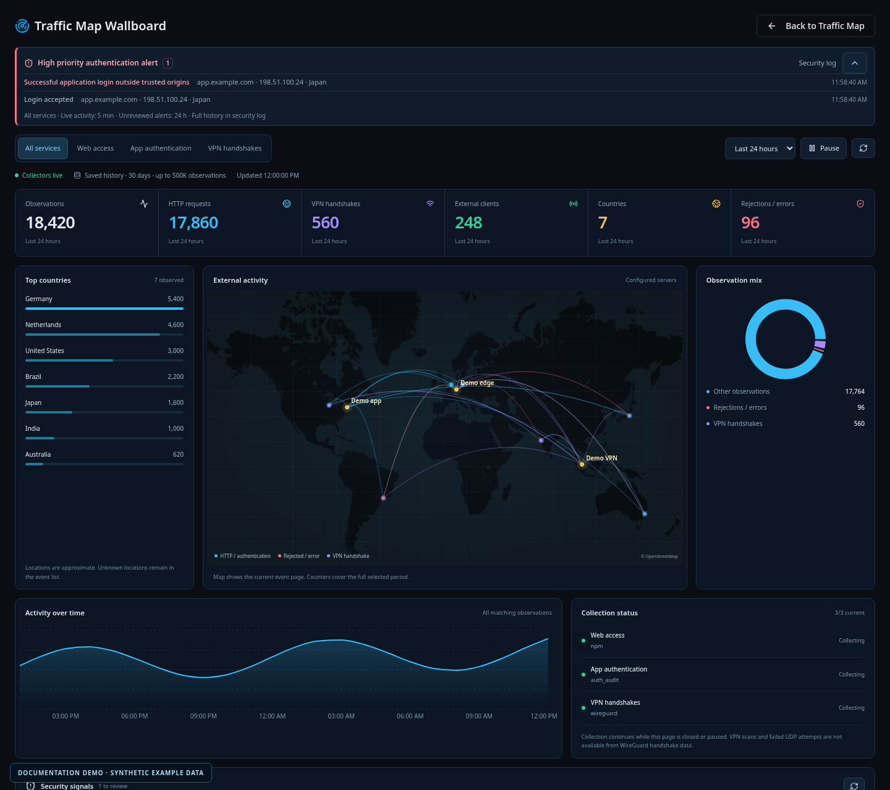

The wallboard shows fictional traffic flows, authentication observations, country counts and an activity timeline. Destination markers use example locations; map data is © OpenStreetMap contributors.

Supported sources use your registered servers and managed SSH credentials:

| Source | What to configure | What it observes |
| --- | --- | --- |
| **Nginx Proxy Manager** | Absolute access-log path or glob. | HTTP metadata; optional recognized Jellyfin or wg-easy login endpoints for explicitly configured domains. |
| **Caddy** | JSON access-log path or glob. | HTTP metadata and client locations when GeoIP is available. |
| **OpenSSH** | The server's systemd journal unit. | Successful authentication; failed authentication is an opt-in per source. |
| **Application audit JSONL** | Authentication audit path and service hostname. | Explicit successful, failed or throttled authentication outcomes. |
| **WireGuard** | Interface, service hostname and optional Docker container. | Authenticated peer handshakes; these do not identify a named user or prove a new interactive login. |

The compact authentication banner appears above both map views, can be
minimized and scrolls with the page. It updates independently of map filters and
pause. Security alerts can be reviewed in the UI. Successful application/VPN
authentication outside configured trusted countries or current DNS addresses
has high priority. **SSH trusts only the current public addresses of configured
DNS names; country exemptions never apply to SSH.** Failed application logins
remain alertable from trusted origins. Missing DNS/GeoIP information never
silently grants trust, and a generic HTTP 200 is not proof of login.

Optional Nextcloud Talk delivery sends notifications to configured administrator
rooms, with retries and visible delivery failures. Alerts provide evidence for
investigation; they do not automatically block clients.

Client locations use a local MaxMind-compatible MMDB file. Set destination
coordinates on each managed server. No external IP geolocation service receives
client addresses; the browser uses OpenStreetMap for basemap tiles. History
stores allowlisted observation metadata, excluding request paths, query strings,
bodies, usernames, passwords and cookies. Default history limits are **30 days
and 500,000 observations**. Source cursors, event deduplication and PostgreSQL
locks support collection across HA API nodes.

See the [Traffic Map guide](docs/traffic-map.md) for reader prerequisites,
audit-log format, trust behavior, retention, privacy and collection diagnostics.

<details>
<summary>Screenshot: authentication evidence and security alerts</summary>

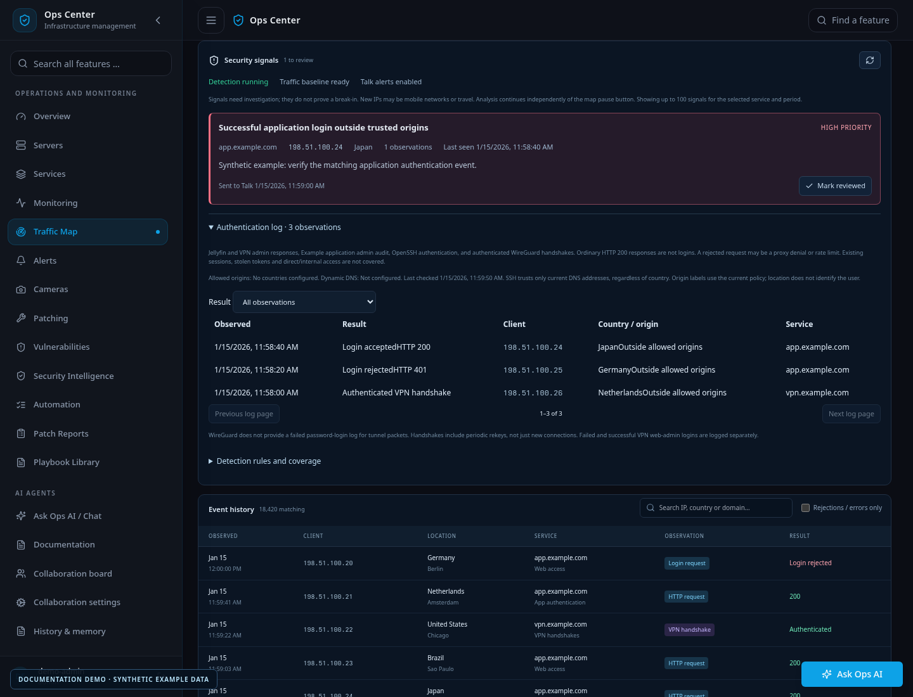

Review example application logins, VPN handshakes and the evidence behind an alert.

</details>

## Configure your own monitoring

Fresh installations start with traffic collection disabled and no sources or
trusted origins.

1. Add your systems under **Servers**, assign managed SSH credentials and
   complete onboarding. Verify each recorded SSH fingerprint independently.
   Enter server coordinates if you want destination markers.
2. Open **Settings → Traffic Map & authentication** as an administrator.
3. Add a source, choose its registered server and reader format, and enter the
   path, journal unit or interface. Use a stable source ID and a display label.
   Managed hosts need Python 3 and the relevant log/command access.
4. Choose trusted countries and DNS names, authentication notifications and
   history limits. Supported limits are **1–365 days**, **1,000–5,000,000
   observations** and up to **32 sources**.
5. Enable the desired sources and collection, save, then check
   **Traffic Map → Collection status**. Settings normally reconcile within
   10 seconds; an existing read may take another 30 seconds to finish.

Later Settings changes do not need a rebuild or service restart. Disabling
collection preserves saved history; removed sources stop collecting and their
observations expire under retention. A new source starts with newly arriving
activity, without replaying historical login alerts. Settings use revision
checks to prevent overwriting another administrator's changes.

Provider settings, host scopes and collaboration budgets are available in the
AI pages. Database/ingress settings, integration URLs and secret-file locations
remain deployment configuration described in [`.env.example`](.env.example)
and [the integration guide](docs/integrations.md). Keep credentials, generated
inventories and runtime state outside Git.

<details>
<summary>Screenshot: Traffic Map and authentication settings</summary>

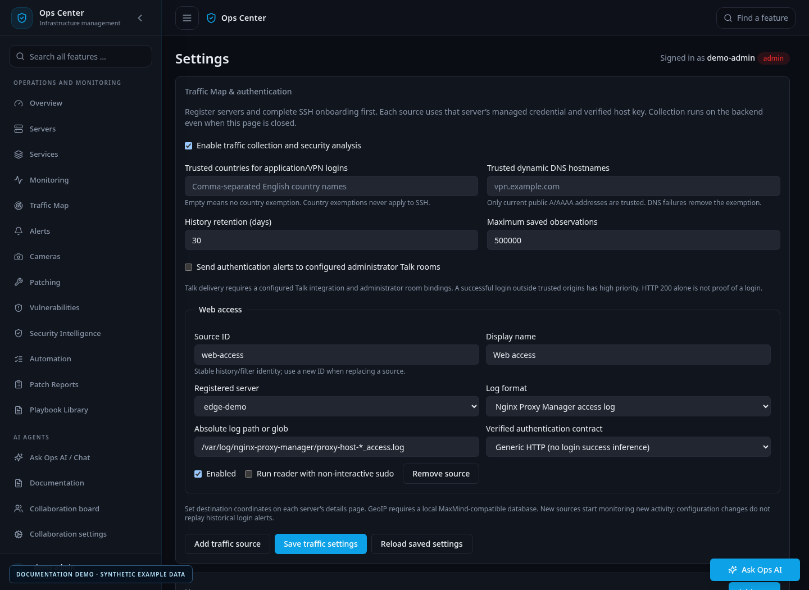

An example source shows the server selector, reader, log path, trust settings and retention controls. Collection is enabled only in this documentation fixture; it is disabled on a fresh installation.

</details>

## Progressive Web App

Ops Center supports ordinary responsive browsing and optional installation on
desktop, phone or tablet. Both use the same backend, authentication, API,
polling, WebSocket and SSE connections.

- **Chrome/Edge:** use the browser's install command or **Install Ops Center**
  when offered.
- **iPhone/iPad:** open in Safari, choose **Share → Add to Home Screen**, and
  enable **Open as Web App** if offered. In-app help explains the manual flow.
- **Wallboards:** open `/wallboard` or `/traffic-map/wallboard` for dedicated
  views. Direct links and refreshes are supported by the frontend SPA fallback.
- **Offline:** an explicit offline page/overlay hides previously loaded live
  status. Reconnect and reload to fetch current data.
- **Updates:** a new version waits for the user's **Reload** action so work can
  be saved first. Open sessions renew before expiry, and read-only streams
  reconnect with the renewed token. Invalid sessions still require sign-in.

Production requires HTTPS. The service worker caches build assets and a
data-free offline page; it does not cache API responses, credentials or live
infrastructure data, and it does not queue or replay operational commands.
Preserve HTML/service-worker revalidation, API/stream routing and SPA fallback
when configuring a reverse proxy. Deployment at the site root is supported.

See [PWA behavior and deployment](docs/pwa.md) for browser requirements,
update handling and tests.

<details>
<summary>Screenshots: installation help and offline protection</summary>

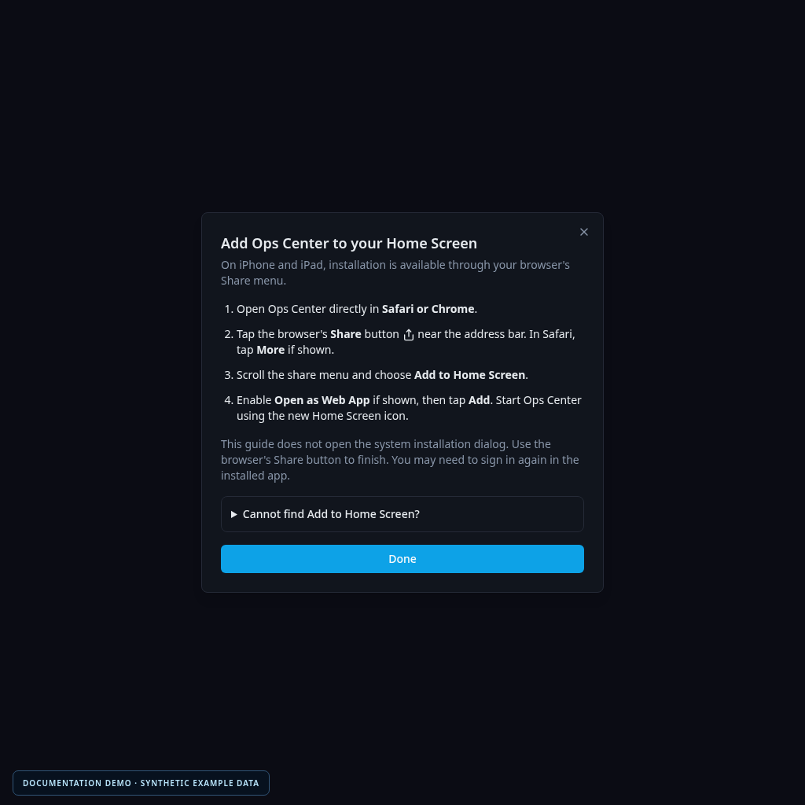

The app's iPhone/iPad installation guide, rendered in an emulated browser. This is the in-app guide, not a capture of the operating system installation dialog.

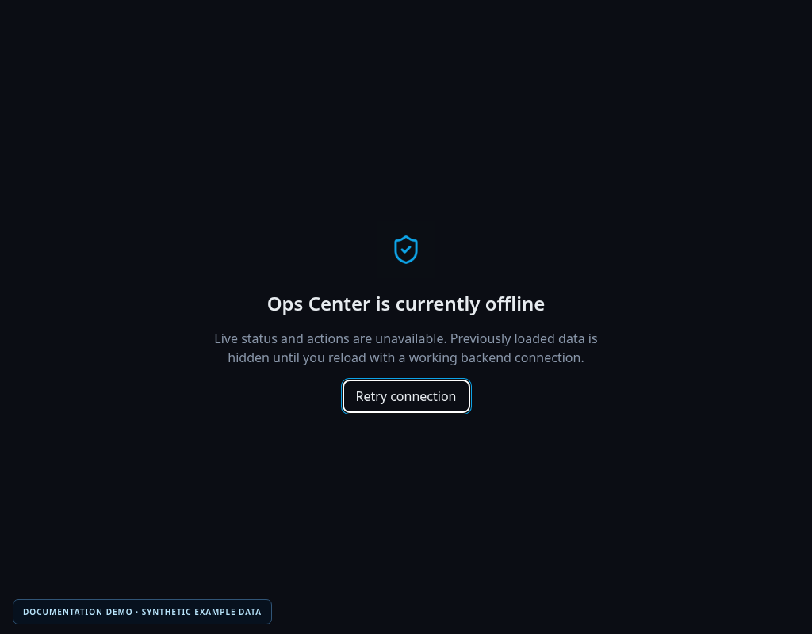

The explicit offline state hides live status until a working backend connection is restored. The documentation fixture triggers this state without contacting a real backend.

</details>

## Agent collaboration

Administrators can enable **AI Agents → Collaboration settings**, select a lead
agent and allowed helpers, and edit rules, tools and budgets. Users then start
an investigation under **AI Agents → Collaboration board**.

Each owner-private board records the question, agent evidence, help requests and
results. Only the addressed helper runs, one at a time, within the configured
depth; the lead combines the findings. Other users, including other
administrators, cannot read the investigation's content.

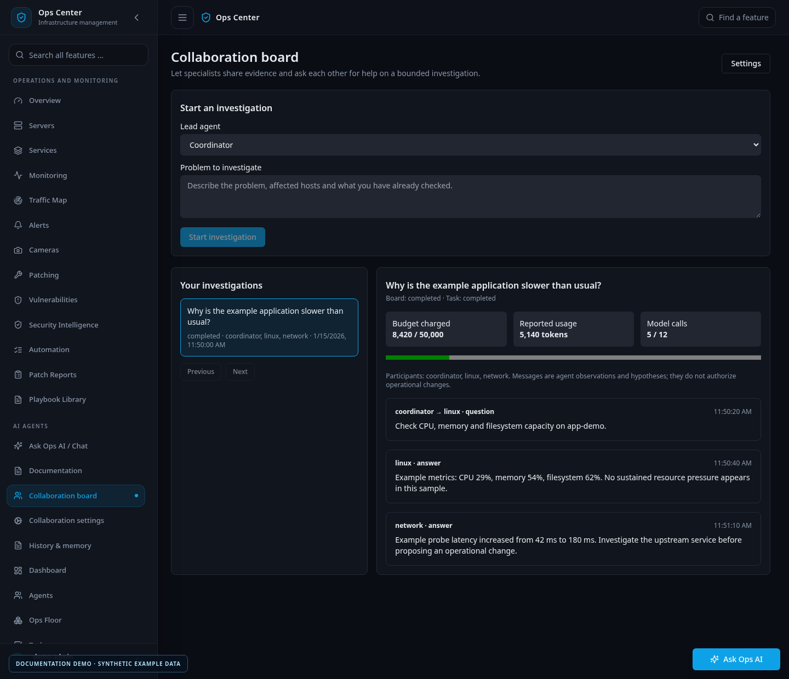

An example investigation shows addressed questions, evidence and separate charged/reported token usage. The transcript is written for documentation; no AI provider was called.

Controls include per-investigation and daily token budgets, output/model-call
limits, messages, help requests, participants, time and concurrency. Backend
permissions enforce the allowed peers, tools and host scopes. Permission
revocations, the master switch and stop requests prevent further admitted work;
a request already running may finish.

Collaboration starts disabled. Its tools are diagnostic: operational changes
still use the existing action-approval workflow. Boards do not automatically
join ordinary chat, Talk or scheduled jobs. See
[collaboration setup and limits](docs/agent-collaboration.md).

<details>
<summary>Screenshot: collaboration budgets and permissions</summary>

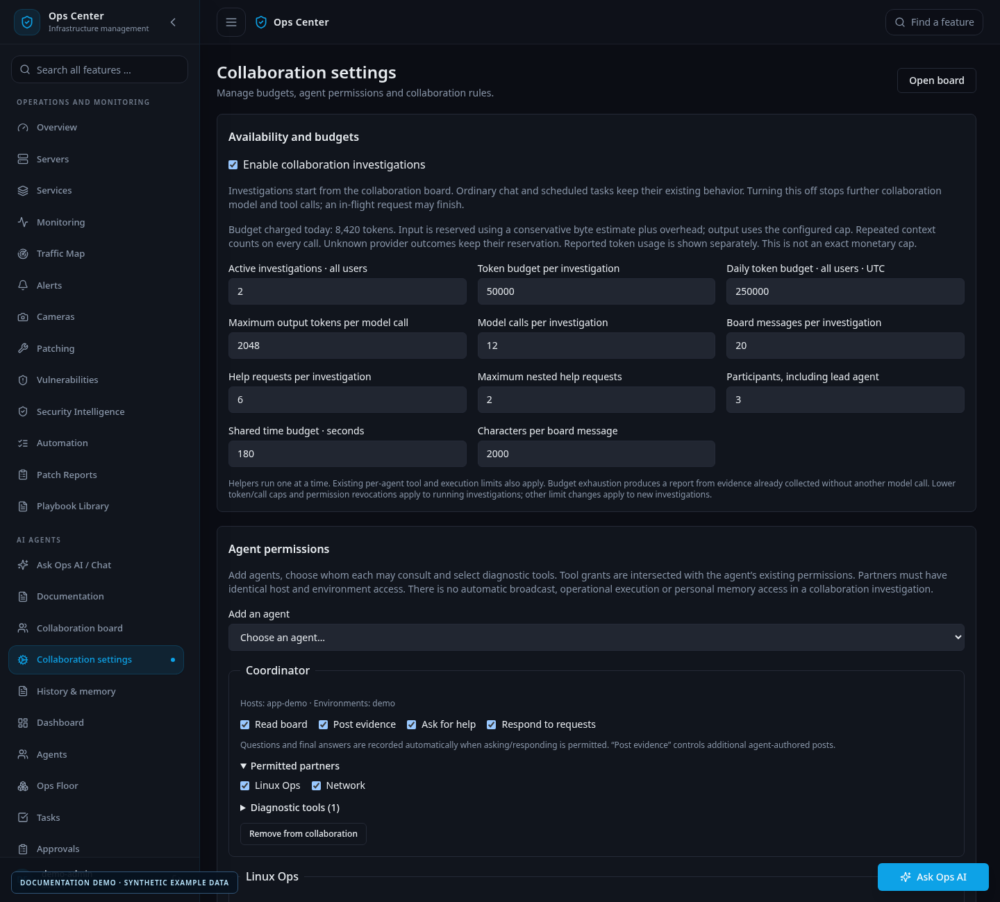

Example limits and explicit partner/tool grants. Collaboration remains opt-in and starts disabled on new installations.

</details>

## Managed disk expansion

A single approved action can preview and grow one supported mounted LVM
filesystem, including its verified Proxmox backing disk when necessary. The
workflow uses existing free capacity first, checks the guest/VM/disk identity,
validates physical storage capacity, grows the required layers and verifies the
resulting filesystem size.

Preview is the default. Execution requires approval bound to the exact target,
mount, requested increment and stable request ID. The default increment is
**50 GiB**; an explicit increment can be **1–1024 GiB**. Request journals record
absolute targets so an interrupted request can resume without applying the
increment twice. Failures retain evidence in the job/action result.

Supported guest layouts are a mounted XFS/ext4 filesystem on an ordinary linear
LVM LV with one PV. Unsupported or ambiguous layouts are refused. The workflow
does not install missing tools, reboot, shrink or reformat disks. Read
[managed disk expansion](docs/disk-expansion.md) for prerequisites, supported
Proxmox storage, capacity rules and recovery steps before using it.

<details>
<summary>Screenshot: disk expansion approval</summary>

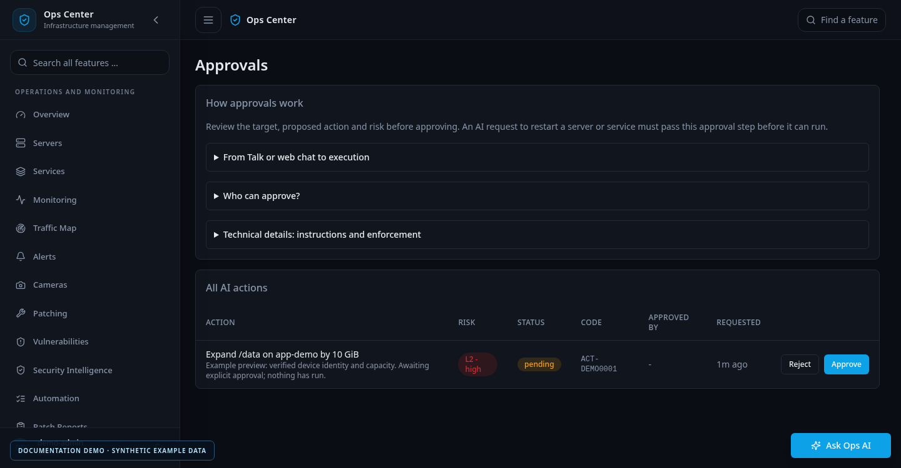

A synthetic pending request shows the target, increment and risk before approval. No storage operation or infrastructure command was run.

</details>

## Integration and access updates

- **Nextcloud Talk:** configure an explicit HTTPS backend, bot secret and
  administrator room/user bindings. Background delivery is opt-in through
  `TALK_NOTIFICATIONS_ENABLED`. Linked users can receive approval requests,
  job progress/results and configured authentication alerts; webhook-supplied
  destinations do not select the outbound server.
- **wg-easy v14:** VPN operations establish a verified HTTPS session using a
  server-side password file and close it afterward. VPN passwords and session
  cookies stay out of the browser. This replaces the former unauthenticated
  `WG_EASY_URL` integration; configure `WIREGUARD_URL` and
  `WIREGUARD_PASSWORD_PATH`.
- **SSH onboarding:** subsequent managed connections verify the stored host
  fingerprint before sending authentication. Changed keys stop collection
  until the host identity is checked.
- **Deployment configuration:** monitoring endpoints, integration connections
  and secret locations are configurable for your installation. Standard and
  HA installer support remains available.

See [optional integrations](docs/integrations.md) and
[agent history and memory](docs/agent-memory.md) for account binding and privacy.

<details>
<summary>Screenshot: optional VPN integration</summary>

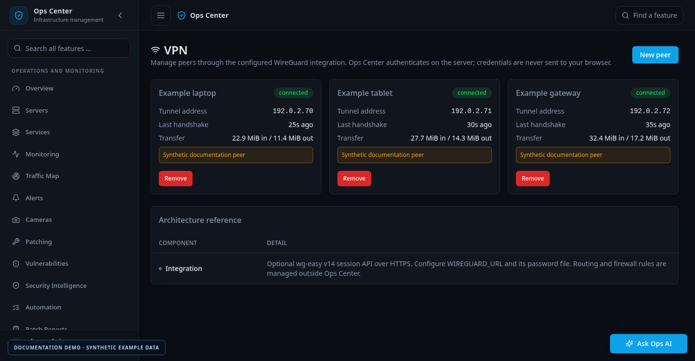

Example peer status, handshake ages and transfer counters. The capture has no VPN configuration or access to a real tunnel.

</details>

## Upgrading this release

1. Back up the database, runtime secrets and deployment configuration. Record
   current traffic-source servers, IDs, paths and trust rules, and retain the
   previous images for recovery.
2. Follow the [standard operations](docs/operations.md) or [HA upgrade
   procedure](docs/ha.md). Apply Alembic migrations through **`0041`** before
   starting the new API, and use matching API, worker and frontend versions.
   The update includes collaboration (`0037`), traffic history/security
   (`0038`–`0039`), disk expansion (`0040`) and traffic settings (`0041`).
3. Recreate your traffic sources and trust rules in **Settings → Traffic Map &
   authentication**. Legacy `TRAFFIC_CADDY_*`, `TRAFFIC_NPM_*` and
   `TRAFFIC_LOGIN_*` variables are not imported. Saved traffic history is
   preserved, but collection must be configured before relying on it.
4. Review the wg-easy and Talk configuration changes above. Confirm collection
   status, authentication rules and any configured notification delivery.
5. For PWA users, verify HTTPS, manifest/service-worker responses, direct
   wallboard links and the update prompt. Keep older hashed assets briefly
   during rolling deployments so existing tabs can finish loading.

Validation recorded for this update includes **298 Python tests**, **65 browser
cases**, all **41 migrations** on an empty PostgreSQL database, a production
frontend build and **five application image builds**. See the dated
[validation report](docs/validation.md) for commands, skipped-by-default database
tests, known warnings and limits. Container/emulated-browser checks do not
establish a clean-VM installation or physical iPhone/iPad installation.

---

## 🤝 Contributing

Contributions, testing and feedback are welcome.

You can help by reporting bugs, testing installation and HA behavior on different Linux systems, suggesting features, improving documentation, creating integrations, adding automation, improving the frontend or submitting pull requests.

For installation problems, include the operating system, Docker/Compose versions and relevant **redacted** error output. Never include credentials, private hostnames, inventories, SSH keys, HA runtime bundles or runtime data.

---

## 🔒 Security

Ops Center can execute infrastructure operations and should be treated as a **privileged management system**.

- Run it on dedicated infrastructure.
- Restrict network access.
- Use HTTPS.
- Protect administrator credentials and SSH keys.
- Use least privilege where possible.
- Never expose runtime or HA-generated secrets publicly.
- Test automation before targeting production systems.
- Keep the host and container images patched.
- For HA, isolate cluster traffic and source-restrict etcd, PostgreSQL, Patroni, Redis and Sentinel ports.

The reference HA topology intentionally does not add authentication to etcd/Sentinel or TLS to cross-host traffic, so those services must remain on an isolated trusted network unless you add stronger transport/security controls.

See [security guidance](docs/security.md) and [HA network guidance](docs/ha.md).

---

## 📜 License

Ops Center application code is distributed under the [MIT License](LICENSE). Third-party libraries, images and geographic data retain their respective licenses; see [THIRD_PARTY_NOTICES.md](THIRD_PARTY_NOTICES.md).

---

## ⭐ Support the Project

If you find Ops Center interesting or useful, consider giving the repository a **star ⭐**.

It helps other Linux, DevOps, self-hosting and infrastructure users discover the project. Contributions, ideas and feedback are very welcome.

---

<p align="center"><strong>Built for people who would rather manage infrastructure than manage ten different dashboards.</strong></p>