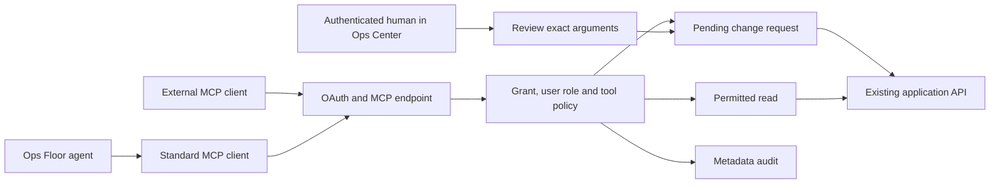

# MCP access and Ops Floor integration

Ops Center exposes reviewed operational tools through the Model Context Protocol (MCP). External assistants and the existing Ops Floor agents can use the same Streamable HTTP endpoint, access policy, change approvals and MCP audit trail. MCP does not replace agents, their model providers, task budgets, conversation memory or the Ops Floor interface.

## What is available

The reviewed catalog contains 113 operational tools covering inventory and host groups, services, monitoring, alerts, logs, Traffic Map and authentication observations, patching and reports, vulnerabilities, containers and stacks, Ansible, VPN peer administration, cluster status and switchover, app templates, AI agents, tasks, findings, memory and collaboration boards. Each tool has a JSON input schema, a domain scope and a minimum role. The existing API remains the business implementation.

See [the complete tool catalog](mcp-tools.md) for exact operations, required roles and deliberate exclusions. New API routes do not become MCP tools automatically.

Two read-only resources explain policy and the caller's permitted tools: `ops://policy` and `ops://capabilities`. Two prompts provide starting points for incident investigation and maintenance planning. `ops_request_status` returns a change request belonging to the current authorization.

## Screenshots

Synthetic examples from the real UI: [client access](images/mcp-clients.png), [agent access](images/mcp-agents.png), [OAuth consent](images/mcp-consent.png), and [change approval](images/mcp-approvals.png).

## Architecture



The MCP server uses the official Python SDK, pinned in the component requirements. Transport state is stateless; PostgreSQL stores clients, authorizations, token hashes, decisions and audit events so API replicas share the same authority. Authorization is checked on each call.

## Enable the service

1. Upgrade the API, frontend and AI worker, and apply database migration **0042** after the existing migrations. API startup runs migrations; for a controlled rolling upgrade, migrate once before starting new replicas. Keep a database backup and the previous application images.
2. Set the same `MCP_PUBLIC_URL` on the API and AI worker, for example `https://ops.example.com/mcp`. This must be the canonical, externally visible URL ending in exactly `/mcp`. HTTPS is required except for loopback development.
3. Route `/mcp`, `/authorize`, `/token`, `/revoke`, `/.well-known/oauth-authorization-server` and `/.well-known/oauth-protected-resource/mcp` to the API. The supplied Caddy configuration includes these paths. Route `/mcp/consent` to the frontend. Preserve Host and Authorization headers and disable proxy caching for these paths.
4. Restart the API and AI worker after changing environment settings. In **MCP access**, an administrator enables the service.
5. Register the intended clients or grant selected tools to an Ops Floor agent. Fresh installations contain no clients, grants, user permissions or environment-specific endpoints.

Only browser-based clients that make cross-origin requests need `MCP_ALLOWED_ORIGINS`, a JSON array of exact trusted origins. Do not use wildcards. Native desktop and server clients normally send no Origin header. The allowlist is an origin validation boundary, not a permissive cross-origin browser CORS proxy.

Disabling MCP blocks new token use and operations. Removing a client/user/tool, disabling a user or agent, reducing a user's role, expiring a grant, or revoking an authorization reduces access on subsequent calls. Pending changes are checked again before execution. Already-started work is not automatically cancelled by revocation.

## Connect multiple external clients

Create a separate registration for each assistant or integration in **MCP access → External clients**:

- Set a descriptive name and exact callback URI supplied by that client. HTTPS callbacks and explicit loopback HTTP callbacks are accepted. Arbitrary callback schemes, wildcards, URL credentials and fragments are rejected. Native clients must use a stable, registered loopback port.
- Select the users permitted to authorize that client.
- Select individual tools. The page derives the required domain scopes and displays them after saving.
- Configure the client with the MCP endpoint, its issued client ID, the displayed scopes and its exact registered callback. Use public-client authentication (`token_endpoint_auth_method=none`), authorization code with **PKCE S256**, and refresh token support.
- The user signs in to Ops Center, reviews the client ID, callback, target resource and tools, and consents to a subset for 1, 7 or 30 days. No tools are selected automatically.

The server deliberately uses administrator-managed registration. Dynamic client registration, client-ID metadata documents, OAuth client credentials, third-party identity assertions and legacy SSE transport are not enabled. A client must support pre-registered public OAuth credentials and Streamable HTTP; client-specific proprietary configuration is not assumed.

Discovery endpoints:

| Purpose | URL |
| --- | --- |
| MCP resource | `https://ops.example.com/mcp` |
| Protected resource metadata | `https://ops.example.com/.well-known/oauth-protected-resource/mcp` |
| Authorization server metadata | `https://ops.example.com/.well-known/oauth-authorization-server` |
| Browser consent | Discovered through the authorization redirect |

Both authorization and token requests must include `resource=https://ops.example.com/mcp`. Tokens issued for this resource cannot authenticate to the normal Ops Center REST API. Browser REST JWTs and upstream provider keys cannot authenticate to MCP.

Access tokens last at most 10 minutes. Authorization codes last 60 seconds after consent and are single-use. Refresh tokens rotate and cannot outlive the authorization. Reusing a consumed refresh token revokes that authorization's token family. Only token hashes are stored.

An SDK connection, after obtaining a token through the OAuth flow, has the following shape. Read the token from the client credential store; never commit it to configuration or source control.

```python
import os
import httpx2
from mcp import ClientSession
from mcp.client.streamable_http import streamable_http_client

async def list_inventory():
    async with httpx2.AsyncClient(
        headers={"Authorization": "Bearer " + os.environ["OPS_MCP_ACCESS_TOKEN"]},
        follow_redirects=False,
    ) as http:
        async with streamable_http_client(
            "https://ops.example.com/mcp", http_client=http
        ) as streams:
            async with ClientSession(*streams) as session:
                await session.initialize()
                return await session.call_tool("ops_list_hosts", {})
```

Use the standard OAuth client support of your chosen MCP client for login and refresh; the example only illustrates the authenticated transport.

## Connect existing Ops Floor agents

In **MCP access → Ops Floor agent access**, choose an enabled agent, the user who owns its tasks, a small explicit tool set and a duration. **Enable tools and grant access** adds those `ops_*` tools to the agent's existing allowed tool list and creates an expiring authorization for that agent/user pair.

During a normal running task, the trusted AI worker obtains a 90-second, task-bound credential from that authorization and uses the standard MCP SDK client. It consumes the credential when the tool session ends. A delegated specialist uses its own agent/user grant while retaining the coordinator task's owner and task ID. No long-lived MCP token or client secret is stored in the agent prompt. The server checks the current task owner, task state, agent enablement, current tool list and grant before the tool is used.

Agents with host or environment restrictions can only use explicitly host-bound tools whose targets satisfy those restrictions. Global lists, reports and settings that cannot enforce that restriction are denied. Scheduled tasks and bounded collaboration investigations do not use these grants. Existing specialized native tools continue through their existing allowlists and AIAction approval policy. Administrators can remove overlapping native tools when adopting their MCP equivalents.

An external client can ask an existing agent through the reviewed AI task tools. That task's own model execution, delegation limits and native approvals still apply. The request to start work requires an MCP change approval because it creates work and can consume model tokens.

## Permission calculation and decisions

Effective access is the intersection of the current user's role, the client tool/scopes policy, the user's consented grant and the current token scopes. Internal agent access additionally intersects its configured tools and task/host policy. These are enforced in code, not inferred from prompt text.

All non-GET operations create a pending change request. The caller supplies a stable `idempotency_key`. Repeating the same request returns its existing status; reusing that key for different arguments is rejected.

The authorizing user or an administrator must review the exact arguments in the authenticated web UI. The deciding user needs at least the operation's required role. Neither an MCP client nor a model can call the decision endpoint or impersonate a human by writing approval text. Native AIAction approvals also remain human-only.

Pending arguments are encrypted using a key derived from the deployment's existing API secret and bound to a SHA-256 digest. A database lock and committed execution claim prevent concurrent approval from executing twice. The business API runs with the original user's current identity and existing route permissions.

A process failure, timeout or server error after execution starts can leave an **unknown** outcome. Inspect the request and the underlying job/system before creating another request. There is no automatic execution retry. A 2xx result can mean a background job was accepted; inspect its job ID for actual completion.

## Audit, limits and retention

MCP audit records contain identity IDs, tool/operation, outcome, timestamp, argument digest and request ID. They do not contain raw arguments, tokens, log results or provider prompts. Audit admission must persist before an operational call proceeds. Existing business services may maintain their own operational job records.

The HTTP request limit is 128 KiB, tool arguments 64 KiB and returned operational JSON 256 KiB. Large results ask the caller to narrow its query. There are at most 60 admitted tool calls per user per minute across replicas, 20 pending changes per authorization, and a defensive transport limit of 240 requests per source address per minute per API process. Apply suitable edge rate limits when many users share a reverse proxy address.

Hourly maintenance expires pending requests and removes their encrypted payload. Completed/rejected payloads are removed immediately; retained results are cleared after seven days. Change-request metadata and MCP audit events are retained for 90 days. Expired authorization requests and tokens are removed after a one-day grace period. Refresh replay records remain until their original expiry plus that grace period.

Metadata audit is append-only through the application interfaces, but a database administrator remains able to alter the database. Export events to your existing protected logging system if you require an independently retained audit record.

## Security boundaries

Operational data and model output are untrusted input, including logs, host names, stack content and instructions contained in remote data. MCP tool annotations and prompts describe behavior; they do not confer permission. Human decisions remain outside the model-controlled interface.

Known structured credential fields and container environment values are redacted from MCP results. Free-text logs and documents can still contain sensitive data: grant log, code/configuration and administrative reads only to clients and users allowed to see those data. Credential creation, key management, VPN private configurations, user administration, raw consoles and human approval authority remain outside the tool catalog.

Keep the API secret consistent across API replicas and the AI worker. Rotating it invalidates browser sessions and prevents decrypting existing pending MCP payloads; reject those requests and create new ones after the rotation. PostgreSQL and Redis remain internal services. Public documentation and example URLs contain no deployment-specific defaults.

## Verification and troubleshooting

Run the standard component tests and frontend build. The PostgreSQL integration suite is opt-in and refuses a database not named `ops_mcp_test`. Set `OPS_MCP_TEST_DATABASE=ops_mcp_test` only with a disposable migrated database, and run `backend/tests/test_mcp_integration.py`. Never point it at your application database.

The suite exercises standard SDK calls, OAuth PKCE, scope/resource binding, client and user checks, refresh replay, role changes, token separation, human-only consent, concurrent decisions, idempotency, path traversal and agent/task ownership. Browser tests cover client registration, consent selection, approval payload binding and the login return to consent.

- **404 endpoint:** check the configured URL, API restart and reverse-proxy route.
- **401:** use an MCP OAuth token for this resource; check expiry/revocation and the authenticated user.
- **403 or no tool:** check all intersections of role, client, consent and agent policy. A scoped agent cannot use unscoped fleet tools.
- **Invalid redirect:** compare exact scheme, host, port, path and query with the registered URI.
- **Invalid target:** send the canonical resource in both authorization and token requests.
- **Pending:** open MCP access and review the request. Pending is not completion.
- **Unknown:** inspect the underlying system; do not automatically retry.

Protocol references: [MCP authorization](https://modelcontextprotocol.io/specification/2026-07-28/basic/authorization), [official Python SDK](https://github.com/modelcontextprotocol/python-sdk), [Streamable HTTP and ASGI](https://py.sdk.modelcontextprotocol.io/run/asgi/).
